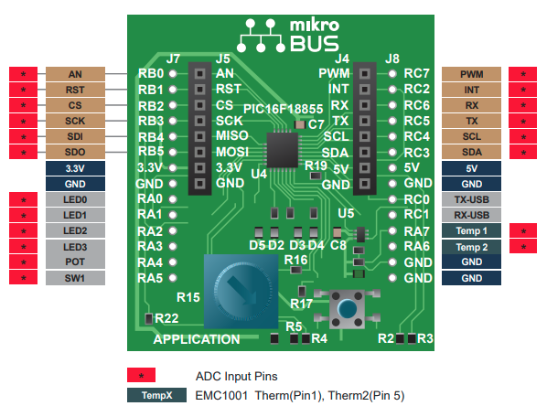
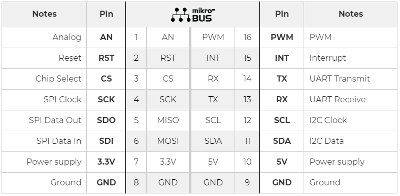
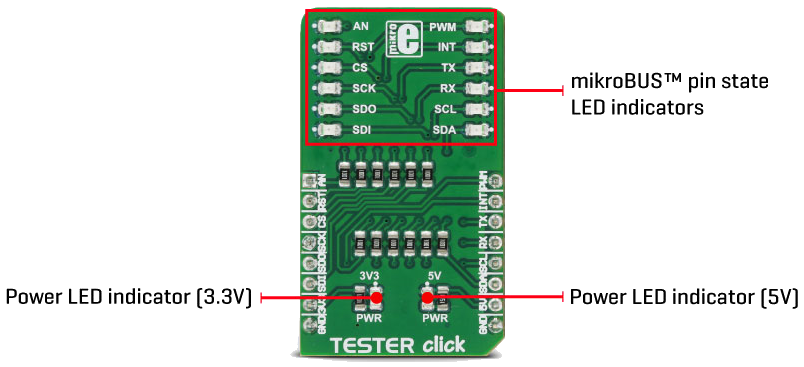

# Demo MPLABXpress-PIC16F18855

https://www.microchip.com/en-us/development-tools-tools-and-software/mplab-xpress

---

## Matériels nécessaires

* Une carte **MPLAB® Xpress Evaluation Board** (vous pouvez la trouver sur Microchip Direct, mais aussi sur Mouser, Digikey et d'autres magasins de composants électroniques en ligne en recherchant le code DM164140)
* Un câble USB type A vers USB micro B (probablement celui que vous utilisez pour votre téléphone portable convient également à moins que vous n'ayez un téléphone portable USB type C ou un iPhone...)
* La dernière version de MPLAB X IDE, ici la version utilisée est la [v5.45](https://www.microchip.com/mplab/mplab-x-ide)
* La dernière version du compilateur XC8, la version utilisée est la [v2.31](https://www.microchip.com/en-us/development-tools-tools-and-software/mplab-xc-compilers#MPLAB%20XC%20Compiler%20Choices) (celle-ci est utilisé à la fois pour les PIC et les AVR)
* Installer le plugin MPLAB® Code Configurator [v4.0.2](https://www.microchip.com/mplab/mplab-code-configurator)
* La documentation (manuel d'utilisation et schéma) de la carte, [disponible sur le site du fabricant](https://www.microchip.com/DevelopmentTools/ProductDetails/PartNO/DM164140)

[MPLAB® Xpress Evaluation Board Pinout](https://ww1.microchip.com/downloads/en/DeviceDoc/30010190A.pdf) (DM164140)



### GENERAL PURPOSE MPLAB® Xpress EVALUATION BOARD

| Description   | MCU's Pin |
| :------------ | :-------: |
| LED D2        |    RA0    |
| LED D3        |    RA1    |
| LED D4        |    RA2    |
| LED D5        |    RA3    |
| Push Button   |    RA5    |
| Potentiometer |    RA4    |

### Communication of MPLAB® Xpress EVALUATION BOARD

| Description | MCU's Pin | Net name |
| :---------- | :-------: | :------- |
| UART-TXD    |    RC0    | F188TXU  |
| UART-RXD    |    RC1    | F188RXU  |
| I2C-SCL     |    RC4    | F188SCL  |
| I2C-SDA     |    RC3    | F188SDA  |

### Utilisation du support mikroBUS™

[mikroBUS™ Standard](https://www.mikroe.com/mikrobus)

[CLICK BOARDS](https://www.mikroe.com/click)



| MCU's Pin | Net name | Description J5 | mikroBUS™ socket | Description J6 | Net name | MCU's Pin |
| :-------: | -------: | -------------: | :--------------: | :------------- | :------- | :-------: |
|    RB0    | F188ANA1 |             AN |                  | PWM            | F188PWM  |    RC7    |
|    RB1    |  F188RST |            RST |                  | INT            | F188INT  |    RC2    |
|    RB2    |   F188CS |             CS |                  | RX             | F188TXM  |    RC6    |
|    RB3    |  F188SCK |            SCK |                  | TX             | F188RXM  |    RC5    |
|    RB4    | F188MISO |           MISO |                  | SCL            | F188SCL  |    RC4    |
|    RB5    | F188MOSI |           MOSI |                  | SDA            | F188SDA  |    RC3    |
|           |          |           3.3V |                  | 5V             |          |           |
|           |          |            GND |                  | GND            |          |           |

---

## Mise en oeuvre de l'UART

Projet **PIC16F18855_Demo_UART.X**

La communication UART est directement accessible via la connexion micro USB avec le PC.

Vous devez seulement modifier l'attribution des broches de l'UART lors de la configuration de MCC :

* TX = RC6 --> RC0
* RX = RC7 --> RC1

**Capture de la communicate série envoié sur le terminal :**

```Serial terminal
__FILE__: main.c
__DATE__: Dec 27 2020
__TIME__: 19:56:04
__VERSION__: 4.2.1 Compatible Clang 4.0.1 (tags/RELEASE_401/final)

BUTTON PRESSED

```

---

## Mise en oeuvre de l'I2C

La carte (DM164140) est équipé de composant U5, un capteur de température numérique connecté au bus I2C du microcontrôleur.

U5: [EMC1001 temperature sensor](https://www.microchip.com/wwwproducts/en/EMC1001)  

## Programmation de la carte MPLAB® Xpress Evaluation Board

Pour charger le fichier HEX dans le microcontrôleur, il faut copier le fichier ./MPLABXpress-PIC16F18855/PIC16F18855_Demo_UART.X/dist/default/production/PIC16F18855_Demo_UART.X.production.hex
dans le lecteur présent dans l'Explorateur de Windows, ici : XPRESS (F:)

---

## Mise en oeuvre de la fonction SLEEP

Projet **PIC16F18855_Demo_SLEEP.X**

[TESTER CLICK (PID: MIKROE-3083)]([images/mikroe-3083-tester-click.png](https://www.mikroe.com/tester-click))



[TESTER click schematic v100](https://download.mikroe.com/documents/add-on-boards/click/tester/tester-click-schematic-v100.pdf)

| Description      | MCU's Pin |
| :--------------- | :-------: |
| LED_LD1  - AN    |    RB0    |
| LED_LD2  - RST   |    RB1    |
| LED_LD3  - CS    |    RB2    |
| LED_LD4  - SCK   |    RB3    |
| LED_LD5  - MISO  |    RB4    |
| LED_LD6  - MOSI  |    RB5    |
| LED_LD7  - PWM   |    RC7    |
| LED_LD8  - INT   |    RC2    |
| LED_LD9  - RX    |    RC6    |
| LED_LD10 - TX    |    RC5    |
| LED_LD11 - SCL   |    RC4    |
| LED_LD12 - SDA   |    RC3    |
| S2 - Push Button |    RA5    |
| OSC-CLKOUT       |    RA6    |
| Potentiometer    |    RA4    |

Potentiometer max = PWM max à 100% => PWMDC Value = 775, avec ADC de 0 à 1023

---

## Liens Internet

* Microchip, [PIC16F18855](https://www.microchip.com/wwwproducts/en/PIC16F18855)
* [Windows Tools for the Electrical Engineer  Serial Terminal](https://learn.adafruit.com/windows-tools-for-the-electrical-engineer/serial-terminal)
